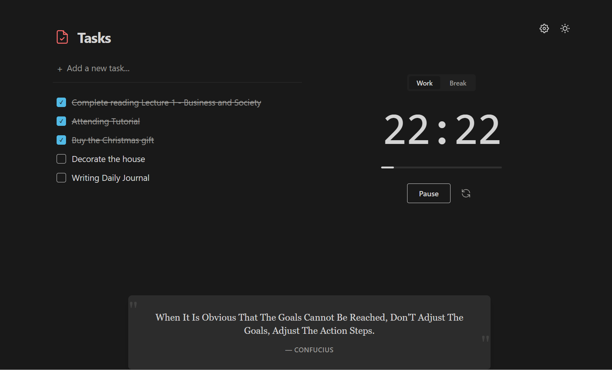

# Pomodoro Focus 🍅

A minimalist, Notion-style Pomodoro timer and task manager designed to help you stay focused and productive. Built with React, TypeScript, and Tailwind CSS.



## ✨ Features

- **Minimalist Design**: Clean, distraction-free interface inspired by Notion.
- **Pomodoro Timer**: Customizable Work and Break intervals.
- **Task Management**: Simple todo list to track your daily goals.
- **Daily Fortune Quotes**: Get inspired with a random quote (offline database of 1000+ quotes).
- **Dark Mode**: Seamlessly switch between Light and Dark themes.
- **Sound Effects**: Audio feedback for timer start/end (toggleable).
- **Auto-start**: Option to automatically loop between Work and Break sessions.
- **Responsive**: Works perfectly on Desktop and Mobile.

## 🛠️ Tech Stack

- **Framework**: [React](https://reactjs.org/) + [Vite](https://vitejs.dev/)
- **Language**: [TypeScript](https://www.typescriptlang.org/)
- **Styling**: [Tailwind CSS](https://tailwindcss.com/)
- **Icons**: SVG (Custom & Minimalist)

## 🚀 Getting Started

### Prerequisites

- Node.js (v14 or higher)
- npm or yarn

### Installation

1.  Clone the repository:
    ```bash
    git clone https://github.com/ethannguyen-uts/Pomodoro.git
    cd Pomodoro
    ```

2.  Install dependencies:
    ```bash
    npm install
    ```

3.  Start the development server:
    ```bash
    npm run dev
    ```

4.  Open your browser and navigate to `http://localhost:5173`.

## ⚙️ Configuration

Click the **Settings** icon in the top right corner to customize:
- **Work Duration**: Default is 25 minutes.
- **Break Duration**: Default is 5 minutes.
- **Features**: Toggle Quotes, Sound Effects, and Auto-start.

## 👤 Author

**Ethan Nguyen**

- GitHub: [@ethannguyen](https://github.com/ethannguyen-uts)

## 📄 License

This project is licensed under the MIT License - see the [LICENSE](LICENSE) file for details.
